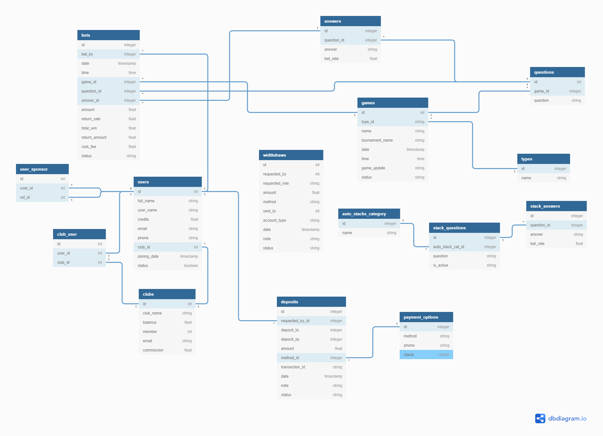

---
# Documentation
---

---

# Database Design (Schema Diagram)

---



---

### Laravel Betting Script

```cmd
~$ php artisan make:migration create_role_user_table
$ php artisan make:middleware RoleChecker

```

# Custom MIddlewire

```php
middleware(['roleChecker:super_admin,admin,club_admin'])
```

# **IMPORTANT COMMAND AFTER**

```cmd
~$ php artisan migrate:refresh --seed
```

# **COMMAND IF CLASS NOT FOUND WHILE SEEDING**

```cmd
~$ composer dump-autoload
```

# Image Package

```cmd
~$ composer require intervention/image
```

# Email Send

# Push test

# Seed Data Command

```cmd
~$ composer require orangehill/iseed
```

# Sponsor Table

php artisan make:migration create_user_sponsor_table

## Middlewere imposed on routes

php artisan make:migration create_sponsor_commission_table

#

`composer.json`

```php
"ext-gd": "*",
```
